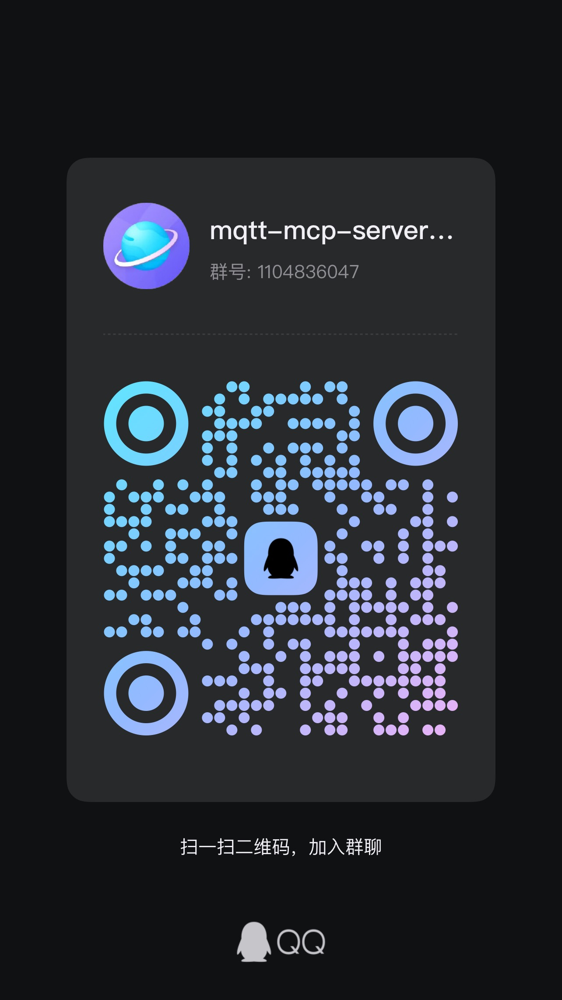

# 🔌 MQTT MCP Server

[](https://crates.io/crates/mqtt-mcp-server)
[](https://opensource.org/licenses/MIT)

> 🌐 **English** | [中文](README.md)

> Let AI Agents control physical devices via MQTT.

Author: [byl](https://github.com/byl)

---

## Quick Start

### Install

```bash
cargo install mqtt-mcp-server
```

### Run

```bash
# Dashboard mode (default)
mqtt-mcp-server --broker tcp://your-broker:1883 --topics "#" --ai --ai-provider ollama --ai-model qwen-coder --web 8080

# Pure MCP mode
mqtt-mcp-server --no-web --mode stdio
```

Open `http://localhost:8080` for the Dashboard.

### Docker

```bash
docker-compose up -d     # one-click: mqtt-mcp + mosquitto
```

---

## AI Agent Capabilities

Once connected, your AI agent can:

- **Subscribe** to MQTT topics to monitor device data in real-time
- **Publish** commands ("turn off pump #3")
- **Query** current sensor values and historical trends
- **Analyze** device health using AI (anomaly detection, predictive maintenance)
- **Manage alerts** — get notified when something goes wrong

### Example

```
User: "What's the temperature of pump #3?"
AI:   [calls mqtt_query_snapshot] → 87°C
AI:   "Pump #3 is at 87°C, above the 85°C threshold. Analyze further?"

User: "Yes"
AI:   [calls mqtt_query_range + mqtt_analyze]
AI:   "Rising 2°C/min — cooling system issue. Reduce load, inspect coolant."
```

---

## MCP Tools

| Tool | Description |
|------|-------------|
| `mqtt_subscribe` | Subscribe to MQTT topics |
| `mqtt_publish` | Publish messages to MQTT topics |
| `mqtt_list_devices` | List all connected devices |
| `mqtt_query_snapshot` | Get latest value for a device/metric |
| `mqtt_query_range` | Query historical telemetry |
| `mqtt_send_command` | Send commands to devices |
| `mqtt_get_alerts` | Get recent alerts |
| `mqtt_analyze` | AI-powered device health analysis |

---

## Rule Engine

Define rules in `config.yaml`. MQTT messages are automatically evaluated:

```yaml
rules:
  - name: "High Temperature"
    device: "pump/*"          # matches device/pump/xxx
    metric: "temperature"
    condition: "value > 80"    # trigger when > 80°C
    action: "alert"
    ai_enhance: true           # auto LLM analysis on trigger

  - name: "Device Offline"
    device: "*"
    metric: "status"
    condition: "last_seen > 300s"
    action: "alert"
    ai_enhance: false
```

**Supported conditions:**

| Expression | Meaning |
|------------|---------|
| `value > 85` | Numeric threshold |
| `rate > 5` | Rate of change per minute |
| `last_seen > 300s` | Device offline detection |

**Severity auto-grading** (for temperature rules): 80–88→info, 88–100→warning, 100+→critical. Alerts include AI analysis results, shown in the Dashboard in real-time.

---

## Pricing

| Tier | Price | Features |
|------|-------|----------|
| **Open Source** | Free (MIT) | Full MCP Server, Rule Engine, Web Dashboard, AI Bridge |

> AI token costs are covered by the customer's own API key. We never pay for your tokens.

---

## Architecture

```
AI Agent ←→ MCP Protocol ←→ MQTT MCP Server ←→ MQTT Broker ←→ IoT Devices
```

- **Written in Rust** — single binary, <6MB, memory-safe
- Supports **stdio** and **SSE** transports
- Built-in **rule engine** with custom DSL
- **AI Bridge**: local pre-filtering + LLM deep analysis, saves tokens

---

## Supported LLM Providers

(Customer provides API key)

| Model | provider value | Base URL |
|-------|---------------|----------|
| DeepSeek | `deepseek` | `https://api.deepseek.com/v1` |
| Qwen | `qwen` | `https://dashscope.aliyuncs.com/compatible-mode/v1` |
| GLM | `zhipu` | `https://open.bigmodel.cn/api/paas/v4` |
| Ollama | `ollama` | `http://localhost:11434/v1` |
| OpenAI-compatible | `custom` | custom endpoint |

---

## Requirements

- Rust 1.75+ (if building from source)
- An MQTT broker (e.g., mosquitto, EMQX, HiveMQ)
- (Optional) LLM API key for AI analysis

---

## License

MIT — see [LICENSE](LICENSE)

---

## Contact

<p align="center">
  <br>
  <b>Scan to join QQ Group</b>
</p>
